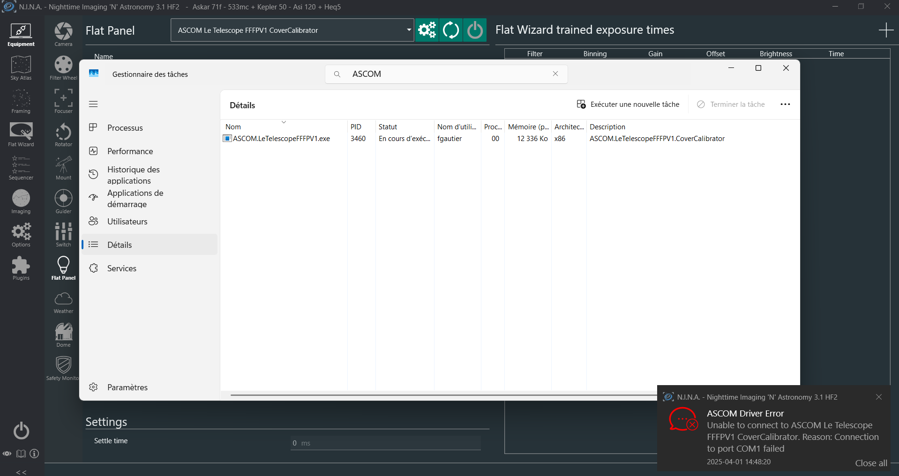

# Le Telescope Flat Panel 
Open source *ASCOM* and *INDI* driven automated flat panel for astrophotography. 

> ⚠ **DISCLAIMER**  
> This project is still very much work in progress. None of it is likely/expected to work at this stage !

## Introduction

This project is an open source initiative, under the MIT license, by *Le Telescope*. This is the v1 of a fully automated and drivable motorized flat panel/dust cap. The device is nicknamed FFFPV1. Don't ask why! If you still want to know, see the  [misc. section](#miscellaneous) of this readme.

This project should contain all you need to build your own *ASCOM* and/or *INDI* driven Flat Panel. 

- [arduino_firmware](./arduino_firmware/): Firware of the programble chip used to control the panel and its cover
- [drivers](./drivers/): Implementation of the drivers
  - [ASCOM](./drivers/ASCOM/) : Implementation of the *ASCOM* driver 
  - [INDI](./drivers/indi/) : Implementation of the *INDI* driver
- [kicad_project](./kicad_project/): Electronic schematics and PCB layout
- [models](./models/): 3D models for the plat cap
- [specifications](./specifications/): Specifications of the project. Mainly the specs of the communication protocol between the drivers and the firmware.

This project, the protocol, the implementation of both the *ASCOM* driver and the firmware, the electronics and the 3D models are heavily inspired by the the work  of [Dark Sky Geek](https://github.com/jlecomte/). And more precisely: 
- [ascom-flat-panel](https://github.com/jlecomte/ascom-flat-panel)
- [ascom-wireless-flat-panel](https://github.com/jlecomte/ascom-wireless-flat-panel)
- [ascom-telescope-cover-v2](https://github.com/jlecomte/ascom-telescope-cover-v2)

Kudos to him. 

## Principle

In this scenario a flat panel is made of two things
- A light panel with variable brightness
- A motorized cover

The firmware updates the state of the flat panel upon instructions of the (*ASCOM* or *INDI*) driver. The communication protocol is serial based. The serial connection is established via USB. Here is a a summary of the protocol 
- Both the driver and the flat panel (its firmware) exchange single line messages; ie terminated by '\n'.
- A message is structured as TYPE:MESSAGE, where TYPE is in "COMMAND, RESULT, ERROR" and MESSAGE is alaphanumerical with spaces and "@"

The driver emmits and the firmware handles the incoming "COMMAND" messages. This kind of message is stuctured as 

- `COMMAND:NAME[@ARGS]` where NAME is [A-Z_]+ and ARGS may be optional or mandatory and their nature may depend on the command.

The firmware then responds with 
- either a `RESULT:CMD_NAME@VALUE` if operation succeeded
- or an `ERROR:ERR_MESSAGE@DETAILS` if anything went wrong

In a nutshell

     -----------------                           ------------
    |                 |                         |            |
    |      Driver     | COMMAND:CMD_NAME[@ARGS] | Flat Panel |
    | (ASCOM or INDI) | --------------------->  | (firmware) |
    |                 | <---------------------  |            |
     -----------------  RESULT:CMD_NAME@VALUE    ------------
                                or
                        ERROR:ERR_MESSAGE@DETAILS

More details on this protocol are provided in [protocol.md](./serial_protocol/protocol.md)


## Softwares developpement and compilations

### Seeduino firmware

The firware is entirely buildable and uploadable using the Arduino IDE
 
#### Pre-requisites 

- [Download](https://www.arduino.cc/en/software/) and install the Arduino IDE
- [Downlaod](https://wiki.seeedstudio.com/Seeeduino-XIAO/#software) and configure the Seeduino XIAO board for the Arduino IDE

#### Compile and upload the firmware

1) Using the Arduino IDE, open the [arduino_firmware.ino](./arduino_firmware/arduino_firmware.ino)

2) Click "verify" to compile the firmware. The output should be something like 
   ```
   d:/appdata/local/arduino15/packages/seeeduino/tools/arm-none-eabi-gcc/7-2017q4/bin/../lib/gcc/arm-none-eabi/7.2.1/../../../../arm-none-eabi/bin/ld.exe: warning: changing start of section .bss by 4 bytes
   d:/appdata/local/arduino15/packages/seeeduino/tools/arm-none-eabi-gcc/7-2017q4/bin/../lib/gcc/arm-none-eabi/7.2.1/../../../../arm-none-eabi/bin/ld.exe: warning: changing start of section .bss by 4 bytes
   d:/appdata/local/arduino15/packages/seeeduino/tools/arm-none-eabi-gcc/7-2017q4/bin/../lib/gcc/arm-none-eabi/7.2.1/../../../../arm-none-eabi/bin/ld.exe: warning: changing start of section .bss by 4 bytes
   d:/appdata/local/arduino15/packages/seeeduino/tools/arm-none-eabi-gcc/7-2017q4/bin/../lib/gcc/arm-none-eabi/7.2.1/../../../../arm-none-eabi/bin/ld.exe: warning: changing start of section .bss by 4 bytes
   d:/appdata/local/arduino15/packages/seeeduino/tools/arm-none-eabi-gcc/7-2017q4/bin/../lib/gcc/arm-none-eabi/7.2.1/../../../../arm-none-eabi/bin/ld.exe: warning: changing start of section .bss by 4 bytes
   Sketch uses 41324 bytes (15%) of program storage space. Maximum is 262144 bytes.
   ```

   Don't worry to much about the warnings. Those are only warnings and can be safely igonered c.f. [arduino forum](https://forum.arduino.cc/t/web-ide-error-changing-start-of-section-by-4-bytes/1218049) and [adafruit forum](https://forums.adafruit.com/viewtopic.php?t=189483#p917530) .

3) Connect the Seeeduino and click upload to test it

#### Warning - Firmware calibrarion

The firmware needs to be calibrated. At first boot the leds will flash to indicate that it needs to be calibrated. 

> **WARNING**
> Disconnect the servo from the mecanical assembly before launching the calibration procedure. 

Then from the IDE connect to the board and using the Arduino serial monitor send (type) the "command" 


```
COMMAND:CALIBRATION_RUN
``` 

The device should perform its calibration procedure and reply with 

```
RESULT:CALIBRATION_RUN@OK
```

Once it has completed, re-attach the right arm to the servo. The device is now ready to be used.

### ASCOM Driver

The ASCOM driver is a C# .Net project that have been first created using the ASCOM 6 Visual Studio 2022 templates. Hence we recommend using Visual Studio 2022 when building it. Feel free to change this procedure to match your tooling. 

#### Pre-requisites 
 
- [ASCOM 6](https://github.com/ASCOMInitiative/ASCOMPlatform/releases/tag/v6.6SP2Release) plateform
- [Visual Studio 2022](https://visualstudio.microsoft.com/fr/vs/). Comunity edition is totally fine. 
- A fully functional [ASCOM developper environement](https://ascom-standards.org/COMDeveloper/Index.htm) . Especiall, you may want to add the ASCOM "extensions" to Visual Studio.


#### Compile and upload the firmware

1) Open the ["solution"](./drivers/ASCOM/ASCOM_6_Driver/ASCOM_6_Driver.sln) from Visual Studio 2022

2) Compile the project using "Ctrl + Shift + B". The result in the console shoudl look something like
  
   ``` sh
   Génération démarrée à 14:12...
   1>------ Début de la génération : Projet : ASCOM_6_Driver, Configuration : Debug Any CPU ------
   1>  ASCOM_6_Driver -> D:\Documents\Perso\Astro\diy\ascom-flat-panel\ASCOM_drivers\ASCOM_6_Driver\bin\Debug\ASCOM.LeTelescopeFFFPV1.exe
   ========== Build : 1 réussite(s), 0 échec(s), 0 à jour, 0 ignorée(s) ==========
   ========== Build s’est terminée à 14:12 et a duré 10,405 secondes ==========
   ```

3) The first time you compile the server you must "register it" on the ASCOM plateform. Open a c"elevated" ommand prompt (with admin priviledges) at the folder where the local server executable is located. Run the local server exe with the /regserver parameter which will create the entry that appears in the ASCOM Chooser. 
  
   ```
   .\ASCOM.LeTelescopeFFFPV1.exe /regserver
   ```

   **This registration only needs to be done once*.

4) You can now launch the driver from any ASCOM client, e.g. N.I.N.A or the ASCOM Diagnostic tool

#### Warning - When used with N.I.N.A

As of N.I.N.A 3.1.HF2, the "ASCOM device instance reference " is not disposed when connection failed. In our setup this may happen if the flat panel is not connected to the PC. In this scenario, the connection will fail, but a "driver process" will hang, waiting for N.I.N.A to dispose of the reference.



This is a known bug c.f. [nina-issue-1378](https://bitbucket.org/Isbeorn/nina/issues/1378/device-instance-not-disposed-when) and [ascom developers  group thread](https://ascomtalk.groups.io/g/Developer/topic/112002512). 

If this happens and some weird side effect happen on reconnection. Just disconnect from the device. Kill the dangling process in the task manager. And reconnect. 

## Indi driver

The indi driver is in its **really** early developement phase. It should no be used for anything else but developement. 

### Pre-requisite

- A fully functional [Indi driver developer environement](https://docs.indilib.org/drivers/basics/project-setup.html). On Windows we recommend using a WSL2 environment. 
- One can also look at how to dev on "indi", c.f. the [getting started](https://docs.indilib.org/getting-started/)

### Compile and install the driver

in the [indi](./drivers/indi/indi_driver/) directory, from VSCode integrated terminal or anyother terminal run

```sh
mkdir build
cd build
cmake -DCMAKE_INSTALL_PREFIX=/usr -DCMAKE_BUILD_TYPE=Debug ../
make
sudo make install
```

or 

``` sh
./make-install.sh
```

The output should be something along the lines of:

``` sh
-- The C compiler identification is GNU 11.4.0
-- The CXX compiler identification is GNU 11.4.0
-- Detecting C compiler ABI info
-- Detecting C compiler ABI info - done
-- Check for working C compiler: /usr/bin/cc - skipped
-- Detecting C compile features
-- Detecting C compile features - done
-- Detecting CXX compiler ABI info
-- Detecting CXX compiler ABI info - done
-- Check for working CXX compiler: /usr/bin/c++ - skipped
-- Detecting CXX compile features
-- Detecting CXX compile features - done
CMake Deprecation Warning at CMakeLists.txt:3 (cmake_minimum_required):
  Compatibility with CMake < 2.8.12 will be removed from a future version of
  CMake.

  Update the VERSION argument <min> value or use a ...<max> suffix to tell
  CMake that the project does not need compatibility with older versions.


-- Found INDI: /usr/lib/x86_64-linux-gnu/libindidriver.so;/usr/lib/x86_64-linux-gnu/libindiAlignmentDriver.so (found suitable version "2.1.3", minimum required is "1.8")
-- Found NOVA: /usr/lib/x86_64-linux-gnu/libnova.so
-- Found ZLIB: /usr/lib/x86_64-linux-gnu/libz.so (found version "1.2.11")
-- Found PkgConfig: /usr/bin/pkg-config (found version "0.29.2")
-- Found GSL: /usr/include (found version "2.7.1")
-- Performing Test COMPATIBLE_FORTIFY_SOURCE
-- Performing Test COMPATIBLE_FORTIFY_SOURCE - Success
-- Configuring done
-- Generating done
-- Build files have been written to: /home/fgautier/Projects/ascom-flat-panel/drivers/indi/indi_driver/build
[ 50%] Building CXX object CMakeFiles/indi_fffpv1_flatpanel.dir/indi_fffpv1_flatpanel.cpp.o
[100%] Linking CXX executable indi_fffpv1_flatpanel
[100%] Built target indi_fffpv1_flatpanel
Consolidate compiler generated dependencies of target indi_fffpv1_flatpanel
[100%] Built target indi_fffpv1_flatpanel
Install the project...
-- Install configuration: "Debug"
-- Installing: /usr/bin/indi_fffpv1_flatpanel
-- Installing: /usr/share/indi/indi_fffpv1_flatpanel.xml
```

## Miscellaneous

- *What is "Le Télescope" ?* This a french astronmy club located at Ivry sur Seine in the Paris suburbs. Please see the [website](https://letelescope.fr) for more informations.
- *Why is this panel nicknamed FFFPV1 ?* This stands for "Florian Florian Flat Panel v1" based on the name of the two orginal authors. 


