# Le Telescope Flat Panel 

[](https://letelescope.fr/)
[](https://github.com/letelescope/ascom-flat-panel/releases)
[](https://github.com/letelescope/ascom-flat-panel/blob/main/LICENSE)
[](https://ascom-standards.org/)
[](https://www.freecad.org/)
[](https://www.kicad.org/)
[](https://www.arduino.cc/)
[](http://unmaintained.tech/) 

Open source *ASCOM* and *INDI* driven automated flat panel for astrophotography. 

> ⚠ **DISCLAIMER**  
> This project is still very much work in progress. None of it is likely/expected to work at this stage !

---

## Introduction

This project is an open source initiative, under the MIT license, by *Le Telescope*. This is the v1 of a fully automated and drivable motorized flat panel/dust cap. The device is nicknamed FFFPV1. Don't ask why! If you still want to know, see the  [misc. section](#miscellaneous) of this readme.

This project should contain all you need to build your own *ASCOM* and/or *INDI* driven Flat Panel. 

- [firmware](./firmware/fffpv1_firmware/): Firware of the programble chip used to control the panel and its cover
- [drivers](./drivers/): Implementation of the drivers
  - [ASCOM](./drivers/ASCOM/) : Implementation of the *ASCOM* driver 
  - [INDI](./drivers/indi/) : Implementation of the *INDI* driver
- [electronics](./electronics/): Electronic schematics and PCB layouts
- [models](./models/): 3D models for the plat cap
- [specifications](./specifications/): Specifications of the project. Mainly the specs of the communication protocol between the drivers and the firmware.

This project, the protocol, the implementation of both the *ASCOM* driver and the firmware, the electronics and the 3D models are heavily inspired by the the work  of [Dark Sky Geek](https://github.com/jlecomte/). And more precisely: 
- [ascom-flat-panel](https://github.com/jlecomte/ascom-flat-panel)
- [ascom-wireless-flat-panel](https://github.com/jlecomte/ascom-wireless-flat-panel)
- [ascom-telescope-cover-v2](https://github.com/jlecomte/ascom-telescope-cover-v2)

Kudos to him. 

The Pulse Width Modulation (PWM), used to control the panel brightness, implementation is heavily inspired, or more accurately shamelessly ripped, from the work of [Khoih Hoang](https://github.com/khoih-prog) and more precisely [SAMD_PWM](https://github.com/khoih-prog/SAMD_PWM/). 

Kudos to him too.

----

## Construction

### Why a "motorized flat panel" ? And what do we mean by "motorized flat panel" ?

In this scenario a flat panel is made of two things
- A light panel with variable brightness
- A motorized cover

The cover is motorized using a servo motor and held in open/close positions using simple magnets. The lightpanel is made using LEDs and the variable brightness is achieved via pulse width modulation (PWM). This "electronico-mechanical" assembly is controlled via a SAM-D21 based board with a custom firmware within a custom PCB. The SAM-D21 is particullarly suited because

- it can output 5V, that is needed to power the servo.
- it can output +3V3 and allow us to choose between 3V anf 5V to power the LEDs.
- It has 16 bits timer counters necessary to achieve fast PWM. We do not want flickering flats...

One can connect and send commands to the flat-panel using Serial (COM Port) over USB. When plugged in the device will be recognized by windows/linux as a COM device. 

Finally this is driven by ASCOM/INDI, such that one can fully automate taking flats following the acquisition sessions of our beloved night sky targets. 

> ⚠ **DISCLAIMER**  
> This project is built around the Seeeduino XIAO board that uses the ATSAMD21G18A-MU chip. This is the only board that we tested. This may work on other boards that uses these SAMD21 chips, but this may need some rework on the firware, the PCB layout and the mechanical assembly. 

Now that we have the big picture let's get real and build the thing !

[INSERT HERE SOME PHOTOS]

### Pre-requisites

Very few pre-requisites are necessary in order to build the flat panel. More precisely one will need to

- have access to a 3D printer, to print the mechanical assembly parts.
- have some soldering skills and a soldering kit, to solder the components to the custom PCB
- install the arduino IDE, to upload the firmware
- love "diy-ing", because you may need to want/need to tweaks things a bit to make it work in your setup. 
  
And that's it ! For instance you won't need software developpement skills as both the driver and the firmware are usable as is. Moreover, the ASCOM driver installer is already pre-compiled and made available to the download. Unfortunaltely one cannot make an "installer" for the arduino firware. Yet using the Arduino IDE to upload the firmware is a matter of three clicks. 

### Bill of material 

[TODO] ADD BILL OF MATERIAL 

### Get a coherent version. 

We heavily use the git version control "tags" to label released versions. We also leverage the "GitHub releases" that add the possibility to pin "binaries" (ie anything we want PCB layouts, Driver installers, mechanincal assembly 3D printer files,...) on "tagged" versions. 

When we deem a version is "usable" we tag it, ie we freez this repository at a particular "commit", and create a release out of it. 

To access the various releases just got the the [releases page](https://github.com/letelescope/ascom-flat-panel/releases/) of this repository.

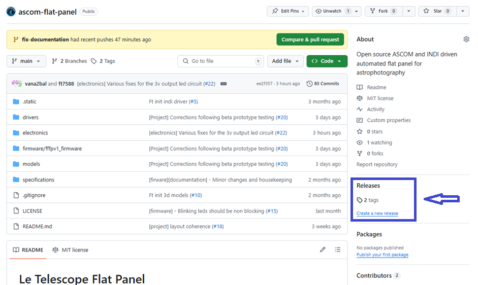

And choose the release you want. The latest should be the "better". 

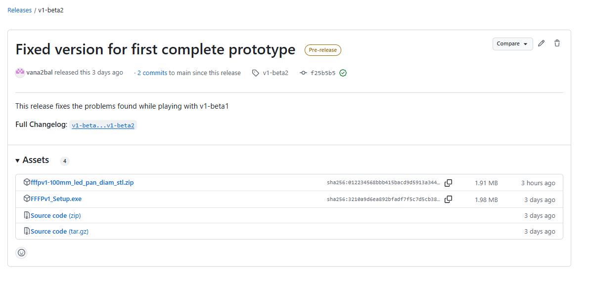

We recommend that you use one of these released version as they are coherent and tested. Be carefull some release are labelled "pre-release" and should be used with caution. Those are developpement, beta and alpha version. Use it at you own risk as all the material on this repository. But even more in this case :D. 

In the same spirit, we do not recommend you use the "head" of the main branch (or any other branch) of this repository as this is work in progress and hence is not guaranteed to be stable or even usable...

### Electronic circuit

We provide two options for the electronic circuit. The diffrence is made on the tension value used to power the LEDs: either +3V3 or +5V. But appart from that the two circuits share the same principles:

- The Pin "8"  of the Seeeduino XIAO is used to control the LED brightness:
  + It is connected, via a voltage divider bridge, to the gate of a IRLZ34N MOSFET.
  - The "+"terminal of the LEDs (strip or pannel) are conn is plugged to the constant +3V3 (or +5V) output of the Seeeduino
  - The "-" terminal of the LEDs (strip or pannel) is connected to the drain of the IRLZ34N MOSFET. 
  - The source of the MOSFET is grounded. 
  - High frenquency PWN is used to swich rapidly ON and OFF the mosfet, and allow to control the effective tension applied to the LEDs. 

> ⚠ **WARNING**  
> The choice of Pin 8 to for PWM is not random. Not all pins of Seeeduino XIAO (and SAM-D21 chips) are not capable to produce high frequency PWM. That's possible with Pin 8 because it use timer counter TCC1 which is 16bits.  And If you want to choose another pin please check the [documentation](https://ww1.microchip.com/downloads/en/DeviceDoc/SAM_D21_DA1_Family_DataSheet_DS40001882F.pdf) first. 


- The Pin "5,6,7"  of the Seeeduino XIAO are used for power control, position control and feedback for the servo:
  - Power control is connected, via a voltage divider bridge, to the gate of a IRLZ34N MOSFET.
  - Feedback is directly connected to the feedback pin of the servo.
  - Position control is directly connected to the position control pin of the servo.
  
- Servo VCC and Servo ground are decoupled using diodes.

- +5V (and +3V3 if needed) ar decoupled from ground using a 10μF capacitors. It acts both as
  - an energy store for a stable +5V/+3V3 output.
  - a "wire" for very high frequency spurious oscillations and effectively ground them. 


#### The +3V3 output for LEDs

This is best suited for small refractors using fewer LEDs and/or fast optics. 

Here is the schematics for this option

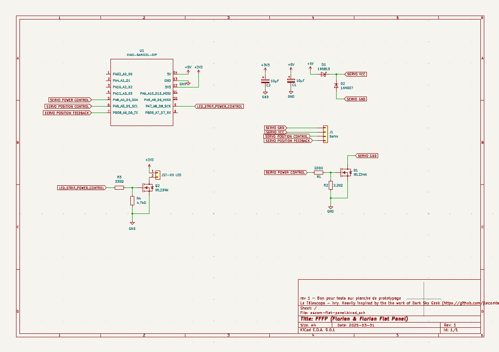

#### The +5V output for LEDs

This is best suited for bigger tubes using a larger number of LEDs drawing more current. 

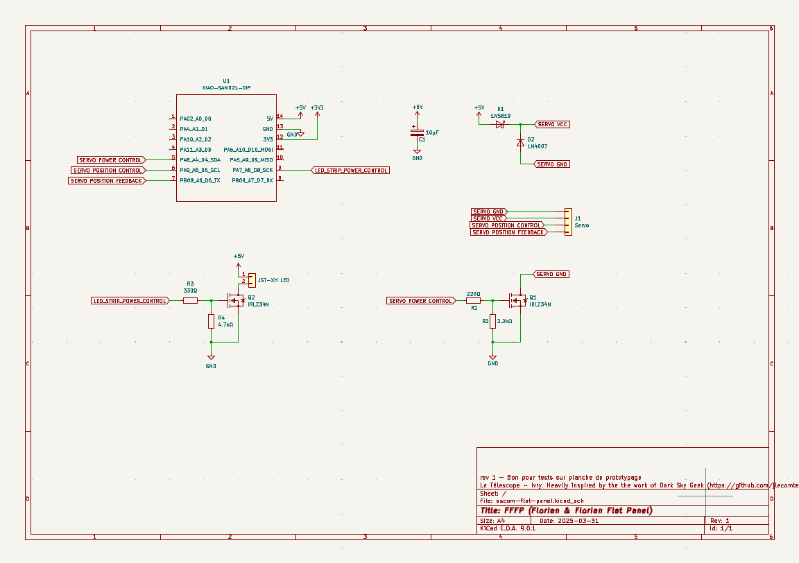

#### Cicruit layout breadbord validation

We recommend you prototype the circuit using breadbords first. 

- This can help you choose between the +5V and +3V3 version. A quick "hint", don't go for to bright ouputs for LEDs as a very bright pannel is in fact not really needed when taking flats. Especially with fast optics. 
- This allows to check each component/part of the circuit independetly. It's always better to find a faulty resistor before it soldered on a PCB.
- It's always fun to prototype. 

Here is and example of what the "+5V" circuit may look like on a breadbord.

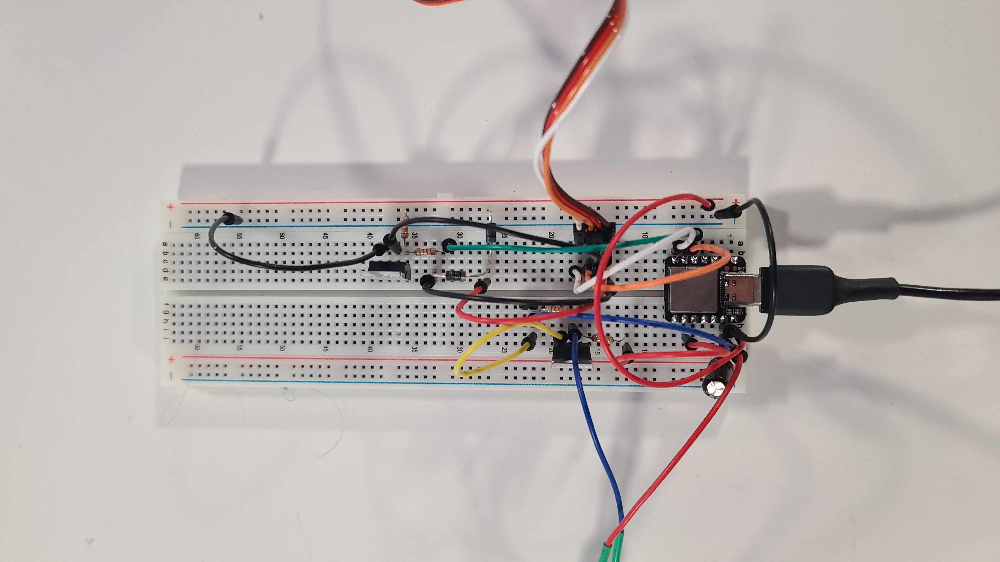.

#### Printed Circuit Board

[TODO] THE PCB IS READY TO BE PRINTED . JUST EXPLAIN HOW HERE

#### Firware upload

#### Pre-requisite

The firmware needs to be uploaded using the Arduino IDE. [Arduino IDE setup section](#pre-requisites-1) of this documentation to set it. 

#### Upload the firware

1. Open the file [firmware source file](./firmware/fffpv1_firmware/fffpv1_firmware.ino)from the Arduino IDE. 

2. Connect the board via US. 
   
3. Select the board.
   
4. Click the "arrow" at the top left to compile and upload the firmware on the board. 

The output should look something like: 

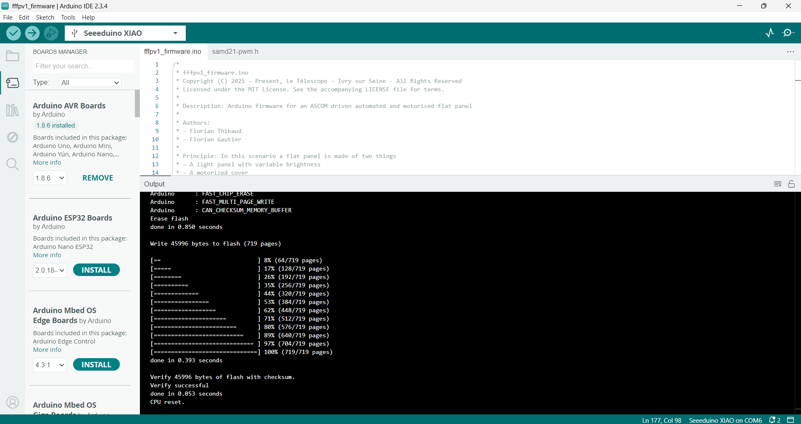

#### Firmware checks

Once the firware uploaded, do not disconnect the board yet. Still from the Arduino IDE open the "Serial Monitor". One connected, In the console type

``` sh
COMMAND:PING
```
the board should answer

``` sh
RESULT:PONG
```

Congrats the Seeeduino is ready to act as your flat pannel controler !

### Mechanical Assembly

Moving on to the actual print and build of the assembly. 

#### Prints from pre-designed assemblies

This repository (and therefore the tagged release version) contains a fully fonctional model. This is made to fit an Askar SQA-55 and uses premade 100mm led panel. It also feature an adapter to fit an Askar 71f. 

"Ready to print" STL files are also pinned to the release. Just download the fffpv1-100mm_led_pan_diam_stl.zip archive, unzip it. The archiver files are organized within two folders "Black" and "White". Files in he "black" repository can be printed in the  color of your choice, but the one in the "white" folder should be printed using white PLA for better performance. This is especially true for the "spacer/diffuser" that, as its name suggests, helps homogenise the illumination of the panel.

#### Modification of pre-designed assemblies

#### Calibration of servo motor 

> ⚠ **WARNING**
> The firmware needs to be calibrated.

At first boot the leds will flash to indicate that it needs to be calibrated. 

> ⚠ **WARNING**
> Disconnect the servo from the mecanical assembly before launching the calibration procedure. 

Then from the IDE connect to the board and using the Arduino serial monitor send (type) the "command" 

```
COMMAND:COVER_CALIBRATION_RUN
``` 

The device should perform its calibration procedure and reply with 

```
RESULT:COVER_CALIBRATION_RUN@OK
```

Once it has completed, re-attach the right arm to the servo. The device is now ready to be used.

### ASCOM Driver Install

You can either used the installer to install the ASCOM driver or build it from source. For the sake of simplicity we recommend using the installer. 

#### Pre-compiled installer

The installer is pined on the each release [releases page](https://github.com/letelescope/ascom-flat-panel/releases/). 

1. From the wanted release, download the file "FFFPv1_Setup.exe". 

2. "Double-click" on the downloaded file to launch it. 

   > ⚠ **WARNING**
   > Windows will warn that the publisher is unknown. This is perfectly fine. As buying a verified signing key, is definitely not a priority for us, we could not sign the installer. Yet this is perfectly safe to use it. 

3. Follow the instruction to install and register the driver. 

Congrats you just installed the driver !

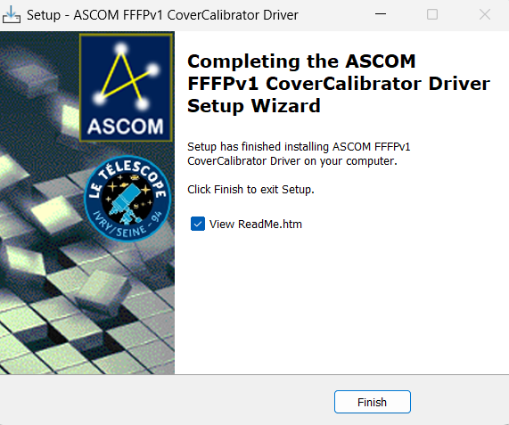

#### Build from sources

To build it from sources please check the relevant section of the "developpement documentation". 

#### Driver validation

Once install is complete, one can use the ASCOM profile explorer tool to check that this was installed properly. From the ASCOM profile explorer check that the *ASCOM Le Telescope FFFPV1 CoverCalibrator* is listed in the Cover Calibrators. 

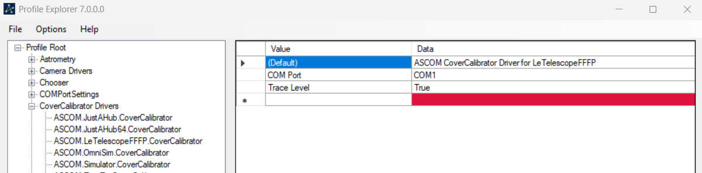 

### INDI Driver

> ⚠ **WARNING**
> INDO driver is NOT functional DO NOT USE IT. 

---

## Testing

To avoid mass troubleshooting, one can test each component fairly separately. Below are listed some tests that can be used to validate the setup. Going from "unit test" to big-bang integration tests from your favourite acquisition software. 

### Firware "unit" testing

Once the firware uploaded, one should already have tested that the seeduino was responsive. If not reconnect the the board via USB. From the Arduino IDE, open the "Serial Monitor". Once connected, In the console type

``` sh
COMMAND:PING
```
the board should answer

``` sh
RESULT:PONG
```
If that's not the case, please make sure that you uploaded the (correct version of the) firmware firt. 

If that is indeed the case, congrats you are ready to test more "interresting" features of the firmware.

#### Set brightness levels

From the "Serial Monitor", in the console type the following command to adjust the LED panel brightness level:

``` sh
COMMAND:BRIGHTNESS_SET@1024
```
the board should answer in the console

``` sh
RESULT:BRIGHTNESS_SET@1024
```
In parrallel, if it is connected to the board, the light panel should have been turned on. Feel free to change the value (number after the '@') to adjust the brightness. Max allowed value is 2043 and min value is 0. 

Use ```COMMAND:BRIGHTNESS_RESET``` to switch off the panel.

Congrats the variable light panel is functionnal. 

#### Open/Close the cover

> ⚠ **WARNING**
> To be able to open/close the panel, the panel should be calibrated first. Check the "mechanical assembly" section for the procedure. 

When turned on, the panel should be closed. To open it,from the "Serial Monitor", in the console type the following command:

``` sh
COMMAND:COVER_OPEN
```
the panel should start moving and the board should answer in the console

``` sh
RESULT:COVER_OPEN@OK
```

Once open to close it simply type in the consle

``` sh
COMMAND:COVER_CLOSE
```
the panel should start moving and the board should answer in the console

``` sh
RESULT:COVER_CLOSE@OK
```

Finally at any given time, to know the status of the mecanical panel type 

``` sh
COMMAND:COVER_GET_STATE
```
the panel should start moving and the board should answer in the console

```
RESULT:COVER_GET@{panel.cover}
```

where panel.cover is string human readable translation of the current cover state. Possible values are in [**OPEN**, **OPENING**, **CLOSING**,]; 

Congrats the motorized cover is functionnal. 

### Driver "unit testing"

After install completion, one one should already have used the ASCOM profile explorer tool to check that this was installed properly. If that's not the case from the ASCOM profile explorer check that the *ASCOM Le Telescope FFFPV1 CoverCalibrator* is listed in the Cover Calibrators. 

 

1. Then check that the driver is instiable using the ASCOM diagnostic tools
   
   a. Select the "Cover Calibrator" device type and elect the "FFPV1 Cover Calibrator"

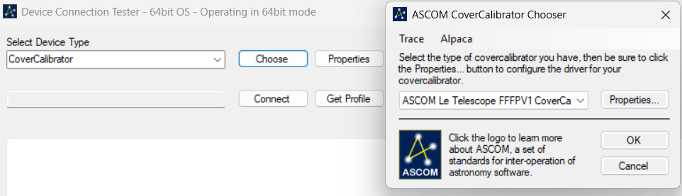


   b. Find and configure the "properties" of the driver

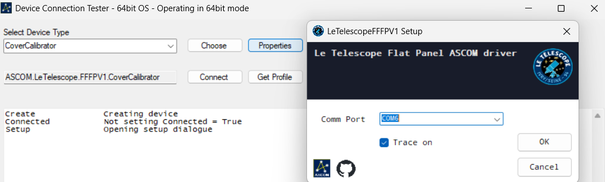

   b. Connect to the driver. Expect nothing much to happen. 

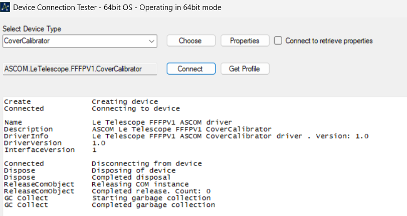

Congrats the driver seems to work as expected !

### Connect to the panel from N.I.N.A via ASCOM

Great ! If you read this, at this stage , the firware, the driver, the mecanical assembly should work, or at least one should be confident enought that they are working. Let's make the final test (and the only one relevant in fact). Let's take some flats from N.I.N.A. 

## Usage

The FFFPV1 should be now be fully usable and drivable from N.I.N.A. 

### Flat-Panel Connection

Let's connect to the flat panel. 

0. Plug the flat panel to the computer via USB

In the equipment tab, from the flat panl section, 

1. Select the *ASCOM Le Telescope FFFPV1 CoverCalibrator*.
2. Click the gear icon and select the correct COM Port. 
3. Hit OK to save the configuration.
   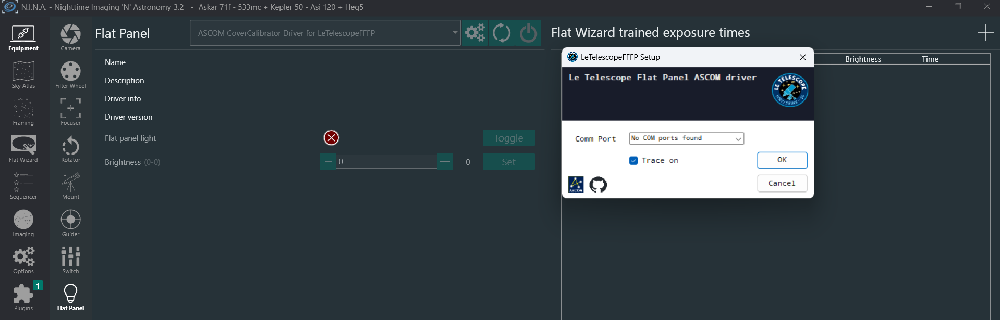

4. Click the "power" button to connect to the flat panel. 
   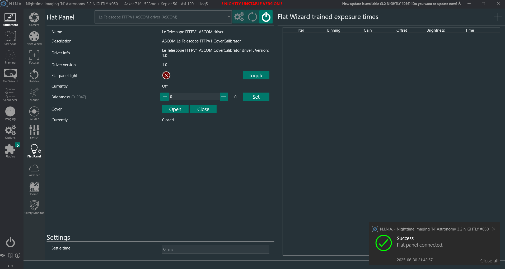

From ther you can turn on and off the panel, set the wanted brightness and/or open/close the cover. 

### N.I.N.A smart flats

Let's now use the N.I.N.A smart flats capabilities to automate flat frames recording.

#### Auto-exposure

#### Auto-brightness

---

## Developpement 

### Principle

In this scenario a flat panel is made of two things
- A light panel with variable brightness
- A motorized cover

The firmware updates the state of the flat panel upon instructions of the (*ASCOM* or *INDI*) driver. The communication protocol is serial based. The serial connection is established via USB. Here is a a summary of the protocol 
- Both the driver and the flat panel (its firmware) exchange single line messages; ie terminated by '\n'.
- A message is structured as TYPE:MESSAGE, where TYPE is in "COMMAND, RESULT, ERROR" and MESSAGE is alaphanumerical with spaces and "@"

The driver emmits and the firmware handles the incoming "COMMAND" messages. This kind of message is stuctured as 

- `COMMAND:NAME[@ARGS]` where NAME is [A-Z_]+ and ARGS may be optional or mandatory and their nature may depend on the command.

The firmware then responds with 
- either a `RESULT:CMD_NAME@VALUE` if operation succeeded
- or an `ERROR:ERR_MESSAGE@DETAILS` if anything went wrong

In a nutshell

     -----------------                           ------------
    |                 |                         |            |
    |      Driver     | COMMAND:CMD_NAME[@ARGS] | Flat Panel |
    | (ASCOM or INDI) | --------------------->  | (firmware) |
    |                 | <---------------------  |            |
     -----------------  RESULT:CMD_NAME@VALUE    ------------
                                or
                        ERROR:ERR_MESSAGE@DETAILS

More details on this protocol are provided in [protocol.md](./specifications/protocol.md)


### Softwares developpement and compilations

#### Seeduino firmware

The firware is entirely buildable and uploadable using the Arduino IDE
 
##### Pre-requisites 

- [Download](https://www.arduino.cc/en/software/) and install the Arduino IDE
- [Downlaod](https://wiki.seeedstudio.com/Seeeduino-XIAO/#software) and configure the Seeduino XIAO board for the Arduino IDE

##### Compile and upload the firmware

1) Using the Arduino IDE, open the [fffpv1_firmware.ino](./firmware/seeeduino/fffpv1_firmware.ino)

2) Click "verify" to compile the firmware. The output should be something like 
   ```
   d:/appdata/local/arduino15/packages/seeeduino/tools/arm-none-eabi-gcc/7-2017q4/bin/../lib/gcc/arm-none-eabi/7.2.1/../../../../arm-none-eabi/bin/ld.exe: warning: changing start of section .bss by 4 bytes
   d:/appdata/local/arduino15/packages/seeeduino/tools/arm-none-eabi-gcc/7-2017q4/bin/../lib/gcc/arm-none-eabi/7.2.1/../../../../arm-none-eabi/bin/ld.exe: warning: changing start of section .bss by 4 bytes
   d:/appdata/local/arduino15/packages/seeeduino/tools/arm-none-eabi-gcc/7-2017q4/bin/../lib/gcc/arm-none-eabi/7.2.1/../../../../arm-none-eabi/bin/ld.exe: warning: changing start of section .bss by 4 bytes
   d:/appdata/local/arduino15/packages/seeeduino/tools/arm-none-eabi-gcc/7-2017q4/bin/../lib/gcc/arm-none-eabi/7.2.1/../../../../arm-none-eabi/bin/ld.exe: warning: changing start of section .bss by 4 bytes
   d:/appdata/local/arduino15/packages/seeeduino/tools/arm-none-eabi-gcc/7-2017q4/bin/../lib/gcc/arm-none-eabi/7.2.1/../../../../arm-none-eabi/bin/ld.exe: warning: changing start of section .bss by 4 bytes
   Sketch uses 41324 bytes (15%) of program storage space. Maximum is 262144 bytes.
   ```

   Don't worry to much about the warnings. Those are only warnings and can be safely igonered c.f. [arduino forum](https://forum.arduino.cc/t/web-ide-error-changing-start-of-section-by-4-bytes/1218049) and [adafruit forum](https://forums.adafruit.com/viewtopic.php?t=189483#p917530) .

3) Connect the Seeeduino and click upload to test it

##### Warning - Firmware calibrarion

The firmware needs to be calibrated. At first boot the leds will flash to indicate that it needs to be calibrated. 

> **WARNING**
> Disconnect the servo from the mecanical assembly before launching the calibration procedure. 

Then from the IDE connect to the board and using the Arduino serial monitor send (type) the "command" 


```
COMMAND:COVER_CALIBRATION_RUN
``` 

The device should perform its calibration procedure and reply with 

```
RESULT:COVER_CALIBRATION_RUN@OK
```

Once it has completed, re-attach the right arm to the servo. The device is now ready to be used.

#### ASCOM Driver

The ASCOM driver is a C# .Net project that have been first created using the ASCOM 6 Visual Studio 2022 templates. Hence we recommend using Visual Studio 2022 when building it. Feel free to change this procedure to match your tooling. 

##### Pre-requisites 
 
- [ASCOM 6](https://github.com/ASCOMInitiative/ASCOMPlatform/releases/tag/v6.6SP2Release) plateform
- [Visual Studio 2022](https://visualstudio.microsoft.com/fr/vs/). Comunity edition is totally fine. 
- A fully functional [ASCOM developper environement](https://ascom-standards.org/COMDeveloper/Index.htm) . Especiall, you may want to add the ASCOM "extensions" to Visual Studio.


##### Compile and upload the firmware

1) Open the ["solution"](./drivers/ASCOM/ASCOM_6_Driver/ASCOM_6_Driver.sln) from Visual Studio 2022

2) Compile the project using "Ctrl + Shift + B". The result in the console shoudl look something like
  
   ``` sh
   Génération démarrée à 14:12...
   1>------ Début de la génération : Projet : ASCOM_6_Driver, Configuration : Debug Any CPU ------
   1>  ASCOM_6_Driver -> D:\Documents\Perso\Astro\diy\ascom-flat-panel\ASCOM_drivers\ASCOM_6_Driver\bin\Debug\ASCOM.LeTelescopeFFFPV1.exe
   ========== Build : 1 réussite(s), 0 échec(s), 0 à jour, 0 ignorée(s) ==========
   ========== Build s’est terminée à 14:12 et a duré 10,405 secondes ==========
   ```

3) The first time you compile the server you must "register it" on the ASCOM plateform. Open a c"elevated" ommand prompt (with admin priviledges) at the folder where the local server executable is located. Run the local server exe with the /regserver parameter which will create the entry that appears in the ASCOM Chooser. 
  
   ```
   .\ASCOM.LeTelescopeFFFPV1.exe /regserver
   ```

   **This registration only needs to be done once*.

4) You can now launch the driver from any ASCOM client, e.g. N.I.N.A or the ASCOM Diagnostic tool

##### Warning - When used with N.I.N.A

As of N.I.N.A 3.1.HF2, the "ASCOM device instance reference " is not disposed when connection failed. In our setup this may happen if the flat panel is not connected to the PC. In this scenario, the connection will fail, but a "driver process" will hang, waiting for N.I.N.A to dispose of the reference.

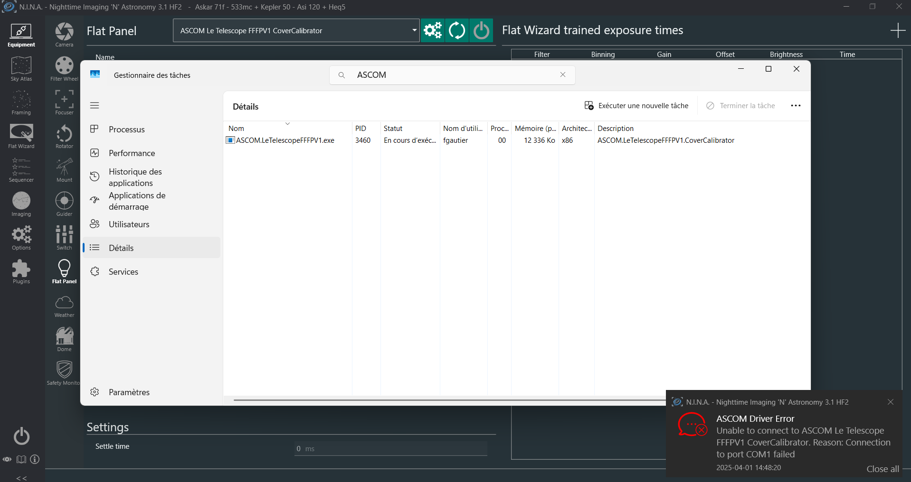

This is a known bug c.f. [nina-issue-1378](https://bitbucket.org/Isbeorn/nina/issues/1378/device-instance-not-disposed-when) and [ascom developers  group thread](https://ascomtalk.groups.io/g/Developer/topic/112002512). 

If this happens and some weird side effect happen on reconnection. Just disconnect from the device. Kill the dangling process in the task manager. And reconnect. 

### Indi driver

The indi driver is in its **really** early developement phase. It should no be used for anything else but developement. 

#### Pre-requisite

- A fully functional [Indi driver developer environement](https://docs.indilib.org/drivers/basics/project-setup.html). On Windows we recommend using a WSL2 environment. 
- One can also look at how to dev on "indi", c.f. the [getting started](https://docs.indilib.org/getting-started/)

#### Compile and install the driver

in the [indi](./drivers/indi/indi_driver/) directory, from VSCode integrated terminal or anyother terminal run

```sh
mkdir build
cd build
cmake -DCMAKE_INSTALL_PREFIX=/usr -DCMAKE_BUILD_TYPE=Debug ../
make
sudo make install
```

or 

``` sh
./make-install.sh
```

The output should be something along the lines of:

``` sh
-- The C compiler identification is GNU 11.4.0
-- The CXX compiler identification is GNU 11.4.0
-- Detecting C compiler ABI info
-- Detecting C compiler ABI info - done
-- Check for working C compiler: /usr/bin/cc - skipped
-- Detecting C compile features
-- Detecting C compile features - done
-- Detecting CXX compiler ABI info
-- Detecting CXX compiler ABI info - done
-- Check for working CXX compiler: /usr/bin/c++ - skipped
-- Detecting CXX compile features
-- Detecting CXX compile features - done
CMake Deprecation Warning at CMakeLists.txt:3 (cmake_minimum_required):
  Compatibility with CMake < 2.8.12 will be removed from a future version of
  CMake.

  Update the VERSION argument <min> value or use a ...<max> suffix to tell
  CMake that the project does not need compatibility with older versions.


-- Found INDI: /usr/lib/x86_64-linux-gnu/libindidriver.so;/usr/lib/x86_64-linux-gnu/libindiAlignmentDriver.so (found suitable version "2.1.3", minimum required is "1.8")
-- Found NOVA: /usr/lib/x86_64-linux-gnu/libnova.so
-- Found ZLIB: /usr/lib/x86_64-linux-gnu/libz.so (found version "1.2.11")
-- Found PkgConfig: /usr/bin/pkg-config (found version "0.29.2")
-- Found GSL: /usr/include (found version "2.7.1")
-- Performing Test COMPATIBLE_FORTIFY_SOURCE
-- Performing Test COMPATIBLE_FORTIFY_SOURCE - Success
-- Configuring done
-- Generating done
-- Build files have been written to: /home/fgautier/Projects/ascom-flat-panel/drivers/indi/indi_driver/build
[ 50%] Building CXX object CMakeFiles/indi_fffpv1_flatpanel.dir/indi_fffpv1_flatpanel.cpp.o
[100%] Linking CXX executable indi_fffpv1_flatpanel
[100%] Built target indi_fffpv1_flatpanel
Consolidate compiler generated dependencies of target indi_fffpv1_flatpanel
[100%] Built target indi_fffpv1_flatpanel
Install the project...
-- Install configuration: "Debug"
-- Installing: /usr/bin/indi_fffpv1_flatpanel
-- Installing: /usr/share/indi/indi_fffpv1_flatpanel.xml
```

## Miscellaneous

- *What is "Le Télescope" ?* This a french astronmy club located at Ivry sur Seine in the Paris suburbs. Please see the [website](https://letelescope.fr) for more informations.
- *Why is this panel nicknamed FFFPV1 ?* This stands for "Florian Florian Flat Panel v1" based on the name of the two orginal authors. 


